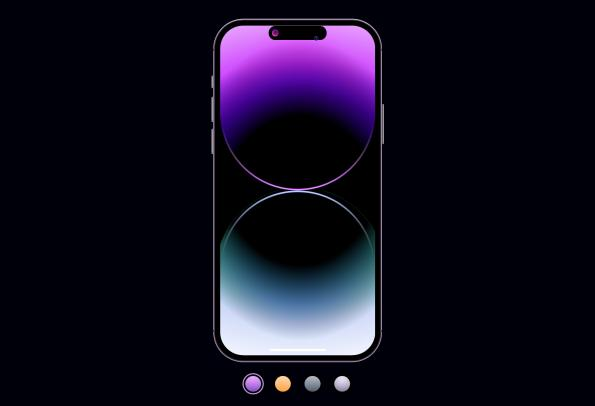
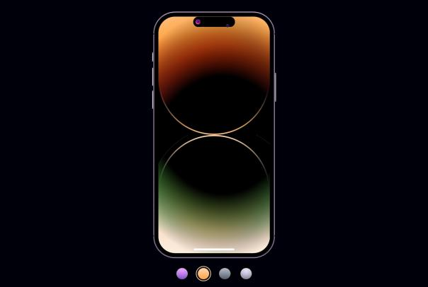
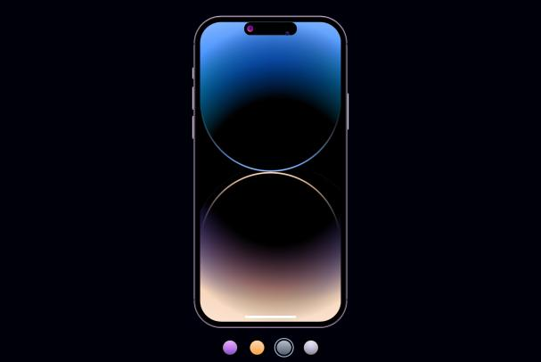
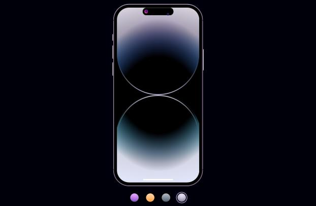

# iPhone 14 Pro Dynamic Island
This is a virtual representation of the iPhone 14 Pro, created with HTML and CSS. The design is inspired by the beautiful and dynamic landscapes found on remote islands.

## Features
* Four dynamic themes to choose from: deep purple, gold, space black, and silver
* Virtual home button and power button
* Virtual front and rear camera
* Virtual screen with dynamic backgrounds
* Virtual notch with customizable content and duration bar

## Screenshots
Here are some screenshots
* Deep Purple  
 

* Gold  

* Space Black  

* Silver  

## How to Use?
To use the iPhone 14 Pro Dynamic Island, simply click the link on the left side. You can choose your preferred theme by clicking on the corresponding radio button. The virtual buttons and camera are not functional, but you can customize the content and duration bar of the virtual notch by editing the HTML code.

## Credits
This project was created byItzBlueSword as a personal project. The design was inspired by the beautiful landscapes of remote islands.  
Tutorial By [AsmrProg](https://github.com/AsmrProg-YT)  
Here is the tutorial video link: https://www.youtube.com/watch?v=W5LPcpIRLzs

## License
This project is licensed under the [MIT License](https://choosealicense.com/licenses/mit/) - see the [LICENSE.md](LICENSE.md) file for details.. You are free to use, modify, and distribute the code as long as you include the original copyright notice and license terms.
